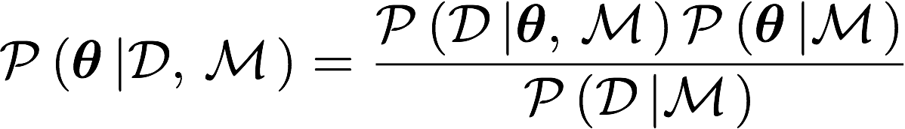
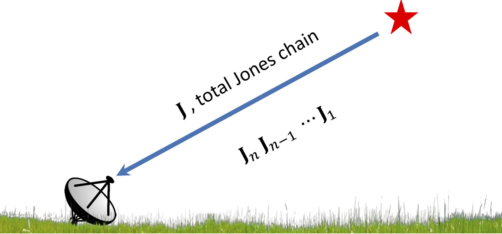

<h1>MSc Thesis</h1>

<section>
	
I have been working mostly on Bayesian Statistical Method for my Masters' research. In particular, we have have developed a nice way of doing Bayesian Model Comparison using Savage-Dickey Density Ratio (SDDR). Refer to the section below for further details. Moreover, as the second part of the thesis, the aim is to predict the likely distance between two point sources which are on top of each other, but buried in noise.</a>

## Bayesian Inference and Bayesian Model Selection

 In the most simplest way, we can state that the posterior distribution of a set of parameters is proportional to the product of the likelihood and the prior. The denominator (evidence or marginal likelihood) simply acts as a normalisation constant but is crucial in Bayesian model comparison.<a>

 While in Bayesian Parameter Estimation, the marginal likelihood is irrelevant (as it is independent of the model parameters), it is crucial in Bayesian Model Selection. For example, using Bayes' Theorem again, <a>

 Therefore, if we have two competing models, <a>

 In words, <a>

 Calculating the Bayesian Evidence is hard (but can be done analytically for Gaussian Linear Models). However, if one model is nested in the other model, one can use the Savage-Dickey Density Ratio to calculate the Bayes Factor. <a>

## Radio Astronomy

In radio interferometry, the signal received from a source (or collection of sources) can be modelled using the Radio Interferometric Measurement Equation <a href="https://arxiv.org/abs/1101.1764">(RIME)</a>. In particular, as the signal propagates through space, it undergoes a series of "transformation" which can each be represented by a Jones Matrix as shown in the figure below.<a>

 Therefore, given the observed signal (the data), can we say at what distance two point sources might be separated of they are both on top of each other, but buried in noise? This becomes trivial as we use Bayesian formalism to simply maginalise over the noise.<a>

<!--
This is a comment

* * * *

## Link to File and Webpage

Link to another file in GitHub itself: [myFileName](Thesis/simple_ref.md)

Link to arXiv for example: [arXiv](http://arxiv.org/)

* * * *

## Font Format

_This creates italic text_

__Whereas this creates bold texts__

* * * *
-->

